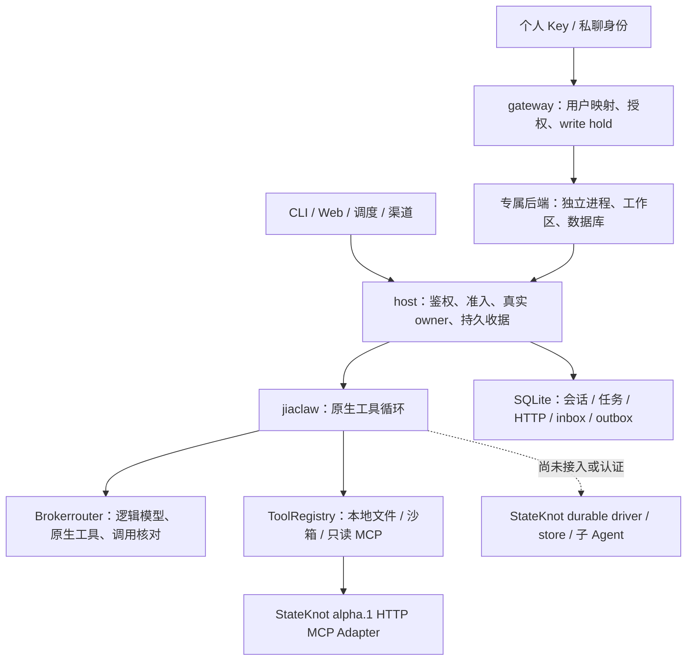

# JiaClaw 架构、代码与业务方向审查

日期：2026-10-10。审查对象：StateKnot/JiaClaw。

结论：保留现有三层和进程隔离架构，先处理已复现的执行结果丢失问题、会话目录资源上限及部署文档漂移，再完成面向用户的安装—执行—核对闭环。后续产品定位建议为“个人和小团队自托管、任务可追溯且异常可接管的 Agent”。这是待用户试用验证的定位假设，并非已有市场需求或完整生产认证的结论。

## 审查基准与证据等级

用户确认按 `origin/main → 当前分支` 审查；本次通过 GitHub API 核对远端 main 与本地引用一致。

| 项目 | 固定值 |
|---|---|
| 基准 | `4b2357fcf01f47ba08d7724edbba7accfb60972c` |
| 审查 head | `d714a831a363a871c435976cb239899a871e47aa`，分支 `codex/tenant-streams` |
| 比较 | `git diff 4b2357fc…...d714a831…`；86 个提交、206 个变更文件 |
| 最新交付 | [draft PR #101](https://github.com/StateKnot/JiaClaw/pull/101)，base `codex/gateway-shutdown` |
| PR 状态 | 44 个附着 PR 均 open/draft，CI 汇总 SUCCESS；尚无 GitHub review 记录，本地/聊天审查单独计 |
| 固定 head 检查 | 7 项成功；公开 Release 的 draft job skipped，不能算已发布 |
| 实机复现二进制 | SHA256 `264c56b486f0610370445cfae236aecc9aee5d4c9cd00f6dc1f219c1800d040d` |

按 [mattpocock-skills:code-review](/Users/jiawy/.codex/plugins/cache/mattpocock/mattpocock-skills/1.3.1/skills/engineering/code-review/SKILL.md) 分开进行 Standards 和 Spec 两轴审查；架构判断使用 [codebase-design](/Users/jiawy/.codex/plugins/cache/mattpocock/mattpocock-skills/1.3.1/skills/engineering/codebase-design/SKILL.md) 的 Module、Interface、Seam 与 Adapter 原则。没有物理 CODING_STANDARDS/CONTRIBUTING/GLOSSARY/ADR 文件；规范依据为用户给定的生产要求和仓库当前接口、恢复、权限合同。

已读取全部提交/文件地图，并风险导向检查工具派发、资源所有权、持久身份、会话、渠道、租户与 UI。累计 diff 有 112,045 行新增，含测试、锁文件与文档；本次不声称逐行穷尽，也不是完整安全扫描。运行时问题有实际证据，资源问题有源码数据流证据而未做 OOM 试验；维护启发不能当作已存在的权限绕过。历史 CI 资格仅用于说明固定源码已有的覆盖，不代替本次发现的验证。

## 架构现状

`jiaclaw-core` 承载配置与领域数据；`jiaclaw` 承载 Agent、工具、工作区、模型与记忆；`jiaclaw-host` 承载入口、SQLite 会话/任务/渠道、独立用户网关和内嵌 Web。StateKnot 发布版实际接入范围是 HTTP MCP；模型使用 Brokerrouter 原生工具合同。不能把包描述中的 durable 当作已经使用 StateKnot durable runtime。

隔离由部署、私有网络与卷配额共同成立；普通 standalone `serve` 仍是单用户实例。网关登记最多 32 用户，不是已认证的大规模共享 SaaS。

### 应保留的设计

- **真实生命周期 owner**：已跟踪 HTTP 和持久投递路径将 Future 取消、流断开、实际模型/工具结束和持久终态分别处理；未知结果进入人工核对，没有盲目网络重试。普通原生循环的结果丢失例外见 Spec P1。流投递 owner 与执行 owner 分开是实际需要，不能为减少类或行数将它们合并。
- **深 Module 已有基础**：共享目录能力和 I/O 容量的工作区工具、模型调用账本、统一出站都把复杂行为集中在实际调用 interface。保持原 ID、授权和预算语义，比引入新的通用框架更有维护价值。
- **SQLite 与专属进程适配当前规模**：事务收据、WAL、进程锁和每用户独立后端已有实际测试。没有当前业务证据要求拆微服务、迁移分布式数据库或引入事件总线。
- **平台差异仍需保留**：Telegram、Slack、Discord、飞书、企业微信的验签、安装身份及回执各异。提取共用准入事务，不合并各平台协议校验和未知状态。

### 应收敛的三个实际 Seam

| Module / Interface | 当前问题 | 生产级变更范围与验收 |
|---|---|---|
| 原生工具执行结果 | 是否停止派发受到 `progress` 是否存在影响；传输设置承担了执行安全语义 | 在原生循环执行层分类“可恢复且无效果的错误”“已完成但结果丢失”“结果未知”，后两类停止后续派发并进入核对。通过旧 HTTP、CLI、调度/渠道和 tracked JSON/SSE 验证；保留正常已知只读错误反馈能力 |
| 会话目录 | 摘要查询拿到全部历史正文，接口深度不足且资源随总数据增长 | 提供只返回摘要的有限分页 interface，Memory 与 SQLite 两个实际 Adapter 保持一致；历史读取单独进行，明确 TTL touch 语义，旧客户端不能被静默截断。实机在有限内存下验证大历史库的单页与后续聊天可用 |
| 渠道准入事务 | 同一 hold/audit/commit 骨架在五个真实渠道重复 | 私有共用事务骨架，平台身份读取仍留在同一事务；封闭操作类型，保持各渠道独立校验。用已有真实私有库回归证明撤销、只读、共享 hold 和事务回滚均保持 |

先修正执行终态和目录，再做有证据支持的小幅提取。不要以“长文件”为理由整体重写：例如 main/registry 大量行是测试，行数本身不能证明 interface 设计错误。

### StateKnot 与 Brokerrouter 的职责

| 领域 | 归属与实际状态 |
|---|---|
| 用户体验、会话、任务展示、渠道授权/投递与部署 | JiaClaw；上游存在能力时由应用真正接线 |
| 持久图执行、可恢复的工具/子任务运行 | StateKnot；当前没有完成 JiaClaw driver/store 接管 |
| 模型协议、供应商调用、逻辑模型和端点路由、embedding/media 能力 | Brokerrouter；应用不能在未知提交后自行换模型重发 |
| 运行资格 | 固定版本、真实供应商/安装、恢复与资源证据分别验收；框架 README 宣称能力不能代替这些证据 |

2026-10-10 实时 API 核对：StateKnot main `aa11b4f44a948aaf2e2baba4c30a297dc828ce6d`，唯一 Release [v0.1.0-alpha.1](https://github.com/StateKnot/StateKnot/releases/tag/v0.1.0-alpha.1)；Brokerrouter main `e01ecb94919d992eb0b74b3db00d70742820b4cc`、无 Release。[StateKnot #140](https://github.com/StateKnot/StateKnot/issues/140)、[Brokerrouter #31](https://github.com/StateKnot/Brokerrouter/issues/31) 与 [#41](https://github.com/StateKnot/Brokerrouter/issues/41) 仍 open；[PR #40](https://github.com/StateKnot/Brokerrouter/pull/40) 仍 draft/unmerged。本次确认的问题属于 JiaClaw，不向框架重复报错。

## 独立代码审查

以下保留两个轴的独立报告与轴内计数，不混合重新排序。P1 表示应先于新增功能处理；P2 是近期修正，P3 是有实际消费者支撑的维护改进。

## Standards

固定比较：`4b2357fc…d714a831`（three-dot）；已读完整 86 个 commit 与 206 文件清单，按资源、授权、存储和取消风险抽查，未声称逐行穷尽 112,045 新增行。未编译或运行测试。

- **[P2 · 硬风险] 会话列表仍按全部历史大小占用内存。** [store.rs:353](/Users/jiawy/Documents/jiaclaw/crates/jiaclaw-host/src/store.rs:353) 的新增 hunk 为 `SELECT id,messages,accessed_ms FROM sessions ORDER BY id`，随后 `decode(...).collect()`；[main.rs:3222](/Users/jiawy/Documents/jiaclaw/crates/jiaclaw-host/src/main.rs:3222) 只需数量却加载全部正文并逐条 `touch`。违背用户 AGENTS 的“生产级可用”及明确资源边界要求：合法历史增长即可使一次 GET 的内存/写事务数随数据库增长；网关 2 MiB 响应上限发生得太晚，不能保护 512 MiB 后端。应改成 SQL 摘要查询、有界分页和明确 TTL 触达语义；OOM 尚未动态复现。
- **[P2 · 启发式：possible Duplicated Code] 共享授权事务被复制五次。** [registry.rs:1025](/Users/jiawy/Documents/jiaclaw/crates/jiaclaw-host/src/gateway/registry.rs:1025) 与 :854/:1200/:1379/:1538 都复制 `insert_hold → audit → tx.commit` 及 UUID/operation 校验。安全合同修正需要五处同步，易产生渠道漂移。保留平台身份验证，收敛内部事务骨架及封闭的操作类型；无需通用插件框架。未发现已可利用的授权绕过。
- **[P3 · 启发式：possible Duplicated Code] 私有状态文件安全逻辑有两个近乎逐字副本。** [model_calls/store.rs:133](/Users/jiawy/Documents/jiaclaw/crates/jiaclaw/src/model_calls/store.rs:133) 的 `private_file/create_private_file/state_path` 与 [semantic/store.rs:347](/Users/jiawy/Documents/jiaclaw/crates/jiaclaw/src/semantic/store.rs:347) 重复链接、权限、inode、祖先目录和 fsync 校验。两个真实消费者已满足共享小模块的条件；仅提取文件能力边界，保持各自 ledger/schema/恢复语义，避免合并不同状态机。

计数：1 项生产资源硬风险，2 项启发式；本轴最重要的是会话目录未在存储读取处封闭资源上限。durable、stdio、供应商验收等明确 open 项未作为规范违规。

## Spec

固定基准：`4b2357fc… → d714a831…`，完整读取86条提交及206个变更文件地图；按工具权限、实际资源所有权、持久请求/恢复、租户隔离与UI路径做风险导向审查，未宣称穷尽全部新增代码。

1. **[P1] 已完成效果的结果超限后，普通工具循环仍允许再次派发，最终还报告 completed。** 合同原文：“结果超限时明确记录操作已经完成、结果过大并禁止据此重放”（`docs/native-tools.md:25`）；文件恢复合同也要求“停止新写入…核对实际文件后再决定”（`docs/workspace-files.md:171`）。`crates/jiaclaw/src/native_agent.rs:220–223` 仅在 `progress.is_some()` 时将工具错误/结果超限设为待核对，普通 `chat_for` 的 `None` 路径继续循环，`native_agent.rs:202–203` 在后续模型最终回复时可返回 Completed。父代理使用固定d714二进制、公开 `/api/chat`、实际无网络/非root Docker工具复现：工具先追加标记并产生300000字节输出；模型收到“tool completed…do not replay”后，以新调用ID提出相同参数，实际标记被追加两次，第三次模型回复后HTTP仍completed。对照组仅追加一次。证据：`runtime-repro.json`、`reproduce_oversized_effect.py`。这是结果丢失后未停止工具派发，不是HTTP自动重试；tracked JSON/SSE已有Progress保护，不能误归为这些路径的问题。应将确定的结果丢失/未知效果作为执行终态，在继续派发前返回需核对，不依赖模型遵守提示。

2. **[P2] 当前部署及HTTP边界说明互相矛盾。** `docs/deployment.md:85`、`docs/architecture.md:75` 写“当前schema10”，而 `store.rs:245–246` 升级11、`:172–175` 的维护命令只接受11；当前合同 `docs/http-turns.md:40` 明确10→11且旧二进制拒绝。`docs/http-turns.md:3,38,109` 仍写租户streaming=false、网关没有 `/api/turns`，与 `docs/tenant-http-turns.md:25,33,81–93` 及 `gateway/turns.rs:81–91,100–145` 的已交付protocol2/SSE入口冲突。`architecture.md:47` 的“不支持多租户授权隔离”也未限定standalone。运维从主要入口文档无法获得统一的升级、恢复和授权范围；应按当前可执行合同更新，并清楚标明租户预览UI仍未接线。

Spec：2项确认发现，轴内最严重为P1结果丢失后的重复效果与错误完成状态；未发现独立的未授权scope creep。明确开放的durable/stdio/外部写入/供应商与媒体认证保持剩余项，不冒充已完成或上游缺陷。

## 业务方向

### 建议的第一产品承诺

“一个可以自托管、明确授权工具、看得见任务结果、遇到异常可以接管的个人助手。”

首批目标建议是愿意自行配置模型和本地环境的个人开发者、知识工作者；次级目标是有管理员维护的少量独立用户。先用个人实例兑现成果，再用已有的专属后端模式验证小团队需求。这里是定位和试用建议：当前没有用户访谈、留存、真实任务成本或付费意愿数据，不能据代码能力推断商业成功。

业务目标应表述为用户能完成什么任务；“追上 StateKnot/Brokerrouter”是依赖接线与资格目标，两者是底层框架，并非个人助手产品的直接竞争对象。继续保留用户原里程碑，但用完成任务的体验决定交付顺序。

### 对竞品的判断

[OpenClaw 当前官方说明](https://github.com/openclaw/openclaw)强调自有设备、已有聊天渠道及可替换模型/执行插件；[安装指南](https://docs.openclaw.ai/start/getting-started)提供向导、后台服务及首条消息路径。[Hermes 官方技能](https://hermes-agent.nousresearch.com/docs/user-guide/features/skills)与[记忆说明](https://hermes-agent.nousresearch.com/docs/user-guide/features/memory)强调跨会话个人记忆与可复用工作方法。这些是文档中的能力主张，本次没有实机比较其效果或质量。

据此推断：JiaClaw 单靠“Rust + 更多渠道 + 功能数量相近”不足以形成清晰定位。可验证的差异候选是授权可控、异常结果可核对、独立用户部署，以及国内聊天渠道的可运维接线。OpenClaw 的[团队指南](https://docs.openclaw.ai/start/teams)也明确一个 Gateway 属于同一信任域，互不信任的租户需独立 Gateway；因此不能泛称竞品没有隔离，应该比较具体部署、资源和运维成本。

### 三个首批任务场景

| 场景 | 当前能用的基础 | 必须补齐的验收与限制 |
|---|---|---|
| 本地资料整理与可追溯成果 | standalone 的文件/记忆、显式 Docker exec、原生工具、SQLite 与 Web | 先修已完成效果结果丢失后的派发；默认授权和成果核验清晰。租户当前只允许 datetime_now/json_query，不能把此场景宣传为已覆盖租户 |
| 定时提醒/结构化摘要并发送到指定渠道 | cron/interval、明确工具及目的地授权、持久 inbox/outbox、未知回执人工核对 | 挑一个实际安装先验收。任务输入来源和允许工具以现有合同为准，不承诺自动访问所有个人资料；租户任务当前不允许外发 |
| 跨设备跟踪一次长任务 | 原 UUID、取消意图、重启后 GET-only 目录、管理员核对、租户 SSE API | 租户 Web 仍调用 JSON，预览 UI 未接线；状态文案清楚区分处理中、成果保存、需核对。没有 durable 工具循环恢复，不宣传断点自动续跑 |

### 交付顺序与完成条件

1. **修复并收敛已有路径。** 关闭本次 Spec P1，处理 Standards 会话目录的容量与分页，更新主要部署合同；形成一个维护者可审核的集成候选。44 个 draft 的累计 head 与四平台候选不等于已合并 main；集成策略和公开发布仍需维护者审核，继续遵守不自动合并/发布。
2. **完成个人用户的第一次成功。** 固定版本安装/配置引导、明确密钥角色、doctor 诊断、授权工具、保存真实成果、异常原编号核对。记录一个未经开发者辅导的完整安装和首任务流程，先解决用户无法完成任务的步骤。
3. **完成一个渠道和 Web 的闭环。** 接租户预览 UI 时复用现有解析器、原身份/权限/取消 owner；在一个目标安装上取得真实回执和用户实际接收证据。先做深入验收，其他渠道按需求和依赖推进。
4. **在上游合同可用时接管 durable 与委派。** 先固定原任务、工具 attempt、预算、取消和恢复语义，再迁移 driver/store；不能在既有收据外再叠一个未接管执行的“durable”包装。MCP stdio/写入和多模态按资源、授权及供应商合同逐项接线。

业务指标建议先记录事实，不以测试数量替代：

- 安装到第一个经核验成果的实际时间、需要人工干预的步骤和失败原因。
- 首批真实任务是否完成、成果是否正确、用户是否在下一周继续使用。
- 一次任务的模型用量/成本、实际耗时和未知结果比例；真实付费模型试验仅在用户明确授权凭证和预算后进行。
- 异常后的原任务查找、人工核对与恢复用时；故障试验中的重复效果必须单独记录，不能混入“完成率”。

首批可招募少量用户逐个观察，规模和合格目标由试用前设定；上述不是已测得的商业数据。暂缓新增一个大型管理平台或以规模化多租户 SaaS 为第一承诺，现有每用户进程/数据库/卷的运维成本和真实供应商资格尚未测清。

## 本次验证与交付边界

- 实机复现：公开旧 `POST /api/chat`、冻结二进制、localhost 原生模型 fixture、现有摘要固定 Alpine 镜像；实际非 root、无网络 Docker，临时工作区内追加标记并产生输出。
- 对照：小输出产生一次效果、两次模型提交，正常 completed；300000 字节输出在收到“已完成，勿重放”反馈后，相同参数产生两次效果、三次模型提交，仍 completed。原 HTTP 响应保存两条结果丢失记录。没有声称网络自动重试，也未用正常只读错误代替副作用问题。
- [可重现脚本](/tmp/jiaclaw-oct10-architecture-review/reproduce_oversized_effect.py)、[结果与固定摘要](/tmp/jiaclaw-oct10-architecture-review/runtime-repro.json)、[详细 Standards 证据](/tmp/jiaclaw-oct10-architecture-review/standards-evidence.md)、[详细 Spec 证据](/tmp/jiaclaw-oct10-architecture-review/spec-evidence.md)。实验实例、临时工作区和本实验标签的容器已清理，证据保存在编译缓存之外。
- 本次没有重新构建 Rust、没有运行全部历史套件，也没有执行 OOM/真实付费供应商/渠道安装试验；明确与既有 1,223 项 Rust 及 PR #101 资格区分。
- 运行前已读 df，实际空间高于 50 GB；保留已有 `/Users/jiawy/Documents/jiaclaw/target`（du 18.79 GB，含可复用编译产物），未清理用户缓存、数据库或 Docker 数据卷。空间的其他变化不归因于本次。
- 只新增本审查报告，生产源码与 head 未修改，没有新功能、自动合并或公开发布。stdio/外部写入、StateKnot durable/委派、真实供应商/渠道、多模态及剩余渠道继续按原里程碑开放。

下一轮技术工作应先关闭结果丢失后的继续派发缺口，再推进目录资源治理和合同同步；租户预览 UI 排在这些已确认问题之后。

## 2026-10-10 执行跟进

以上报告保留原固定 `d714a831` 的发现和证据。后续资格分别核对，不修改原始复现或把历史问题重新排序：

| 轴 / 项目 | 实际跟进 |
|---|---|
| Spec 执行结果丢失 P1 | PR #102 已修复并固定 head 核对七作业/四候选；有界输出仍正常，已完成结果丢失停止批次/下一模型轮，不依赖 progress |
| Standards 目录资源 / Spec 文档 | PR #103 的存储侧摘要、有限分页、TTL不触达已固定 head 核对；首次Mac503的未确认根因与同head重跑通过分开记录 |
| 租户预览 UI | PR #104 固定 `7fcdc5f3` 的七官方作业、七浏览器/九组真实预览、四实际归档已独立核对；初版工具选择核验P2经真实负例修复，最终本批两轴未解决0 |
| Standards 渠道准入重复启发式 | PR #105固定ac680464的两轴和七CI/四实际候选独立合格；五个真实Adapter共用IMMEDIATE事务与故障矩阵，历史P2关闭 |
| Standards 私有文件能力重复启发式 | 两个实际Store共享私有叶子文件检查/打开；最终独立Standards本批新增0、历史P3关闭，Spec新增未解决0；ledger/schema/恢复语义分别保留，本批官方资格另计 |

业务定位和指标仍为待真实试用验证的假设；浏览器/候选绿日志不是真实供应商、渠道安装或商业数据。完整里程碑、durable/委派和未认证能力仍按[roadmap](../roadmap.md)开放，不自动合并或公开发布。
